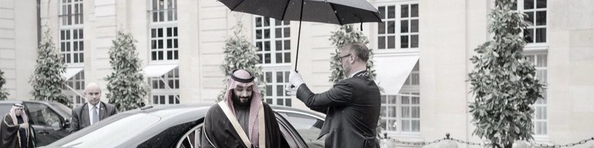

# 🌐 Budur Portfolio Website

A modern and responsive personal portfolio website built using **HTML** and **CSS** to showcase my profile, technical skills, projects, and contact information.

## 🔗 Live Website

👉 https://buduraljohani.github.io/Portfolio-Website/

---

## 📖 About

This portfolio represents my academic journey and personal projects as a **Computer Science student** at **Qassim University**.

The website highlights:

- Personal introduction
- Technical skills
- Featured projects
- Contact information
- Responsive modern design

---

## 🚀 Features

- Modern and clean UI
- Responsive layout
- Sidebar navigation
- Project showcase section
- Skills section
- Contact section
- GitHub Pages deployment
- Smooth hover effects

---

## 🛠️ Technologies Used

- HTML5
- CSS3
- Google Fonts
- GitHub Pages

---

## 📂 Featured Projects

### 🚗 Seat Belt Detection Using Teachable Machine
Artificial Intelligence project developed using Google's Teachable Machine for classifying whether a driver is wearing a seat belt.

Repository:
https://github.com/buduraljohani/Seat-Belt-Detection-Using-Teachable-Machine

---

### 🤖 Robot Dog Concept Design
A conceptual educational robotics design created as part of a robotics learning activity.

Repository:
https://github.com/buduraljohani/Robot-Dog-Concept-Design

---

### 🌐 Portfolio Website
This personal portfolio website showcasing my projects and technical skills.

Repository:
https://github.com/buduraljohani/Portfolio-Website

---

## 📷 Preview

---

## 👩‍💻 Author

**Budur Aljohani**

Computer Science Student

Qassim University

Saudi Arabia

---

## 📬 Contact

- GitHub: https://github.com/buduraljohani
- LinkedIn: https://www.linkedin.com/in/budur-aljohani-468a813a8
- X (Twitter): https://x.com/imBudurAljohani
- Email: buduraljohani@gmail.com

---

## 📄 License

This project is created for educational and portfolio purposes.
